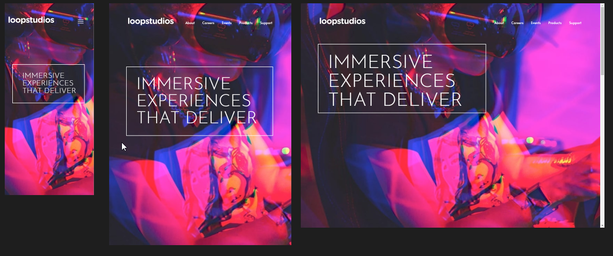
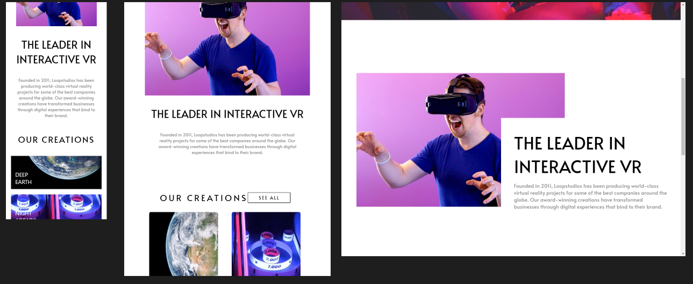
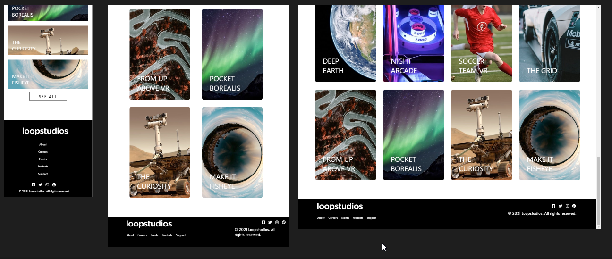

# Frontend Mentor - Loopstudios landing page

## Olá! 👋

[Frontend Mentor](https://www.frontendmentor.io) Desafios com projetos realistas

## The challenge

Criar um design responsivo com base nas imagens proporcionadas
Meu foco neste projeto foi melhorar o entendimento sobre custom hooks
Pontos a melhorar:
- Sintaxe
- Organização
- Responsividade

## Design

